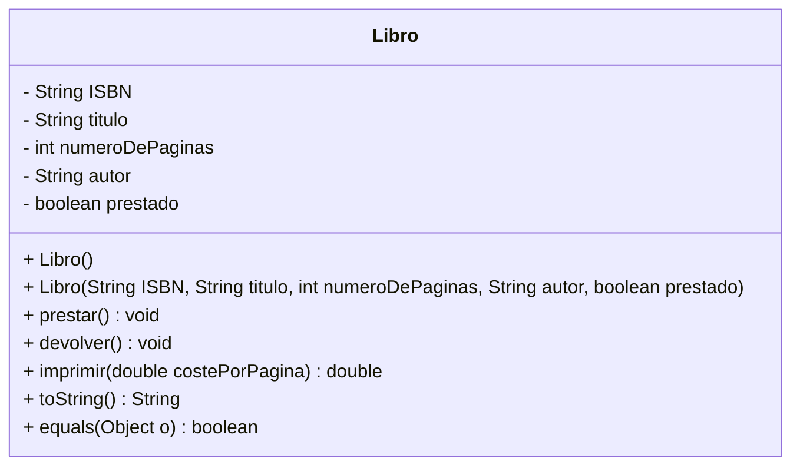

1. Realiza una clase que represente a un libro. Un libro se define por:

```mermaid
classDiagram
    class Libro {
        - String ISBN
        - String titulo
        - int numeroDePaginas
        - String autor
        - boolean prestado
        + Libro()
        + Libro(String ISBN, String titulo, int numeroDePaginas, String autor, boolean prestado)
        + prestar() void
        + devolver() void
        + imprimir(double costePorPagina) double
        + toString() String
        + equals(Object o) boolean
    }
```
